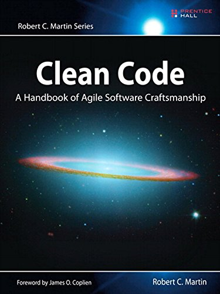
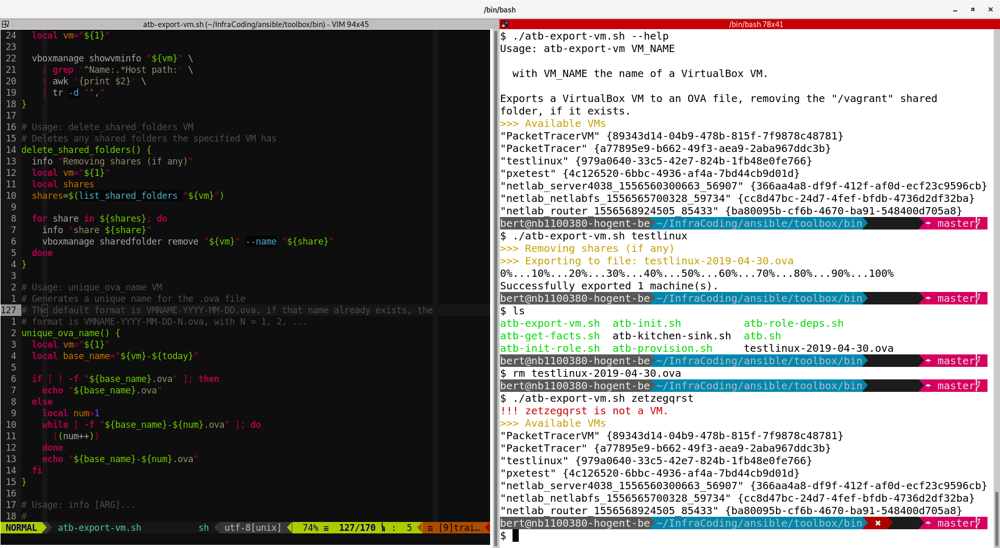

@snap[west text-22 text-bold]
Clean Bash<br><br>
*Leveling up your shell scripting skills*
@snapend

@snap[south-west byline text-06]
Bert Van Vreckem, LOADays, 2019-05-04
@snapend

---

## Introduction

+++

### whoami

- Bert Van Vreckem
- Lecturer ICT at University College Ghent (HOGENT)
    - Linux, stats, project/thesis coach
- Open source enthousiast
    - Linux user since ~2000
    - Ansible, Git, LaTeX, Vagrant, ...

+++

@title[The good, bad & ugly]

Who **loves** scripting in Bash?

+++

I expected no/very few hands...

+++

Bash is

- ugly
- arcane
- weird

+++

However, Bash also

- is everywhere
- is not going anywhere soon
- is useful for automating tedious tasks
- has no dependencies

+++

If you accept this, then hopefully also:

- learning Bash is useful
- code quality is valuable
- good coding practices matter
- revision control goes without saying

+++

@title[Clean code]



+++

Clean code = the intent is clear

+++

### Goal of this talk

- Improve robustness
- Improve readability

of your shell scripts

---

## Improve robustness

+++

### My setup

Vim + ALE + ShellCheck

templates.vim + Ultisnips

+++

ALE: Asynchronous Lint Engine

<https://github.com/w0rp/ale>


+++

ShellCheck: Static analyzer for Bash

<https://www.shellcheck.net/>


+++

templates.vim

<https://www.vim.org/scripts/script.php?script_id=1172>

[My Bash script template](https://github.com/bertvv/dotfiles/blob/master/.vim/templates/sh)

+++

Ultisnips

<https://www.vim.org/scripts/script.php?script_id=2715>

[My Bash snippets](https://github.com/bertvv/dotfiles/blob/master/.vim/UltiSnips/sh.snippets)

+++

### Write code incrementally and test continually!

+++

### Have at least 2 terminals open

+++



+++

### "Unofficial Bash Strict Mode"

```bash
set -o errexit   # abort on nonzero exitstatus
set -o nounset   # abort on unbound variable
set -o pipefail  # don't hide errors within pipes
```

+++

### Internal field separator

```bash
# Default
IFS=$' \n\t'

# Recommendation: remove the space
IFS=$'\n\t'
```

See example [ifs.sh](https://github.com/bertvv/presentation-clean-bash/blob/master/examples/ifs.sh)

+++

### Print log messages

```bash
readonly debug='on'
log() {
    printf '\e[0;33m[INF] %s\e[0m\n' "${*}" 1>&2
}
debug() {
  [ "${debug}" = 'on' ] && printf '\e[0;36m[DBG] %s\e[0m\n' "${*}" 1>&2
}
error() {
  printf '\e[0;31m[ERR] %s\e[0m\n' "${*}" 1>&2
}
```

+++

### Bash's "debug mode"

```bash
set -x
#
# Problematic code
#
set +x
```

Shows each command, after applying substitutions

+++

### Unit tests with BATS

Bash Automated Testing System

<https://github.com/bats-core/bats-core>

+++

BATS examples:

- <https://github.com/HoGentTIN/ilnx-labos/blob/master/labo6/tests/02-gebruikerslijst.bats>
- <https://github.com/HoGentTIN/ilnx-labos/blob/master/labo8/tests/1-passphrase.bats>
- <https://github.com/HoGentTIN/elnx-sme/blob/master/test/pu004/lamp.bats>

---

## Functions as building blocks of robust, clean shell scripts

+++

### Bash functions

- scripts inside scripts
    - but no subshell!
- pass arguments: positional parameters
- return value = exit status
    - of last statement
    - `return 0`, `return 1`, etc.
- other "return values" through `stdout`

+++

```bash
# Function declaration syntax
my_function() {
    # ...
}

# Calling a function
my_function arg1 arg2 arg3
```

+++

```bash
# Usage: mkd DIR
#   Create a directory and cd into it.
mkd() {
  local dir="${1}"
  mkdir -p "${dir}" && cd "${dir}"
}

# Example:
mkd a/b/c
```

+++

```bash
# Usage: copy_iso_to_usb ISO_FILE DEVICE
# Copy an ISO file to a USB device, showing progress with pv (pipe viewer)
# e.g. copy_iso_to_usb FedoraWorkstation.iso /dev/sdc
copy_iso_to_usb() {
  # Name parameters
  local iso="${1}"
  local destination="${2}"

  # Local variable:
  local iso_size
  iso_size=$(stat -c '%s' "${iso}")

  log "Copying ${iso} (${iso_size}B) to ${destination}"

  dd if="${iso}" \
    | pv --size "${iso_size}" \
    | sudo dd of="${destination}"
}
```

+++

### Make variables in functions local

```bash
# Variables within functions are defined in the same
# environment/shell as the script!
my_fun() {
  var='Hello world!'
}

my_fun

echo "${var}"
```

+++

```bash
# Local variables only exist within the function
my_fun() {
  local var='Hello world!'
}

my_fun

echo "${var}" # This will fail
```

---

## Idempotence

+++

@quote[**Idempotence** is the property of an operation whereby it can be applied multiple times without changing the result beyond the initial application.](Wikipedia)

+++

This script can only be run once:

```bash
#! /bin/bash
user="${1}"
password="${2}"

adduser "${user}"
passwd --stdin <<< "${password}"
```

+++

```bash
# Recommended: first, test whether change is necessary
if ! getent passwd "${user}" > /dev/null
then
    adduser "${user}"
fi
passwd --stdin <<< "${password}"
```

+++

### Make your scripts idempotent

- Script can be run under any cirumstance
- Result is desired state of the system
- Makes no unnecessary changes
- Fail early if something goes wrong

---

## Improve Readability

+++

### Variable names

- Local variables: small letters
    - `${my_var}`
- Environment (exported) variables: capitals
    - `${MY_ENV_VAR}`

+++

### Give positional parameters meaningful names

```bash
user="${1}"
password="${2}"
```

In functions, makes (number of) expected parameters more explicit

+++

### In functions

```bash
# Usage: ensure_user_exists USER
ensure_user_exists() {
  local user="${1}"

  if ! getent passwd "${user}" > /dev/null
  then
      adduser "${user}"
  fi
}

# E.g.
ensure_user_exists bert
```

+++

### Use `$()` for command substitution

```bash
# Backticks are hard to distinguish from other quotes
iso_size=`stat -c '%s' "${iso}"`

# Recommended: $(cmd) syntax is more clear
iso_size=$(stat -c '%s' "${iso}")
```

+++

### Prefer long parameter names

```bash
# You won't remember what each option means
rsync -avHXzR --delete --exclude-from="${exclude_file}" \
  "${source_dir}" "${destination_dir}"

# Recommended: long options are more descriptive
rsync --verbose --archive --hard-links --xattrs --compress \
  --relative --delete --exclude-from=${exclude_file} \
  "${source_dir}" "${destination_dir}"
```

+++

### Split long lines

```bash
# Long lines are harder to interpret
dd if="${iso}" | pv --size "${iso_size}" | sudo dd of="${destination}"

# Recommended: one operation per line
dd if="${iso}" \
  | pv --size "${iso_size}" \
  | sudo dd of="${destination}"
```

+++

### Encode complex tests in a function

```bash
# The meaning of the test is not immediately apparent:
if ! getent passwd "${user}" > /dev/null
then
  adduser "${user}"
fi

# Recommended: use a meaningfully named function
user_exists() {
  local user_name="${1}"
  getent passwd "${user_name}" > /dev/null
}

if ! user_exists "${user}"; then
  adduser "${user}"
fi
```

---

## Other recommendations from Clean Code

+++

### Use descriptive names

+++

@quote[There are only two hard things in Computer Science: cache invalidation and naming things.](Phil Karlton)

+++

### Single responsibility principle

- Functions should do only one thing
- They should do it well
- They should do it only
- Command/Query separation

+++

### One level of abstraction for each function

- No nested for loops

+++

### Have no side effects

- Don't change non-local variables!
- Effect of function only depends on function parameters

+++

### Ordering functions: the stepdown rule

- The code should read like a top-bottom narrative
- Every function is followed by those at the next level of abstraction

---

## Q&A


<https://xkcd.com/1319/>

+++

## Keep in touch!

Bert Van Vreckem

[@bertvanvreckem](https://twitter.com/bertvanvreckem)

<https://twitter.com/bertvanvreckem>

<https://github.com/bertvv/presentation-clean-bash>
